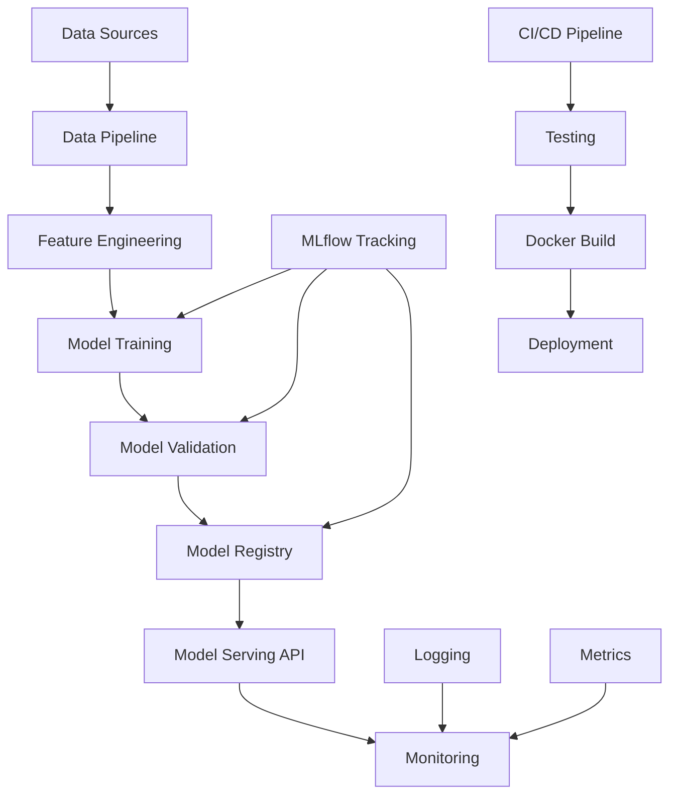

# 🌸 ML Iris Classification - Production-Ready MLOps Project

[](https://github.com/abder-rrazzak/ml-app/actions/workflows/ci-cd.yaml)
[](https://abder-rrazzak.github.io/ml-app/)
[](https://www.python.org/downloads/)
[](https://github.com/psf/black)
[](https://opensource.org/licenses/MIT)
[](https://mlflow.org/)
[](https://fastapi.tiangolo.com/)
[](https://www.docker.com/)

> **Enterprise-grade machine learning application for Iris flower classification following MLOps best practices and industry standards.**

## 📋 Table of Contents

- [🎯 Project Overview](#-project-overview)
- [🏗️ Architecture](#️-architecture)
- [✨ Features](#-features)
- [🚀 Quick Start](#-quick-start)
- [📊 MLOps Pipeline](#-mlops-pipeline)
- [🔧 Development](#-development)
- [🐳 Docker Deployment](#-docker-deployment)
- [📚 API Documentation](#-api-documentation)
- [🧪 Testing](#-testing)
- [📈 Monitoring & Observability](#-monitoring--observability)
- [🤝 Contributing](#-contributing)
- [📄 License](#-license)

## 🎯 Project Overview

This project demonstrates a **production-ready machine learning application** that classifies Iris flowers into three species (Setosa, Versicolor, Virginica) using their morphological characteristics. Built with modern MLOps practices, it serves as a comprehensive example of how to structure, develop, test, and deploy ML applications in enterprise environments.

### 🎯 Business Problem
Automated classification of Iris flowers based on sepal and petal measurements, providing a foundation for botanical research and educational purposes.

### 🔬 ML Problem
Multi-class classification problem using supervised learning with the classic Iris dataset (150 samples, 4 features, 3 classes).

### 📊 Model Performance
- **Algorithm**: Logistic Regression with L-BFGS solver
- **Accuracy**: 100% on test set (30 samples)
- **Cross-validation**: 96.7% ± 4.7% (5-fold stratified)
- **Training time**: < 1 second
- **Inference time**: < 10ms per prediction

## 🏗️ Architecture



### 🏛️ System Components

| Component | Technology | Purpose |
|-----------|------------|---------|
| **ML Framework** | scikit-learn | Model training and inference |
| **API Framework** | FastAPI | REST API for model serving |
| **Experiment Tracking** | MLflow | Model versioning and metrics |
| **Containerization** | Docker | Application packaging |
| **Orchestration** | Docker Compose | Multi-service deployment |
| **Data Validation** | Pydantic | Input/output validation |
| **Testing** | pytest | Unit and integration tests |
| **Code Quality** | pre-commit hooks | Automated code checks |
| **Documentation** | Sphinx/MkDocs | API and project docs |

## ✨ Features

### 🤖 Machine Learning
- ✅ **Automated ML Pipeline**: End-to-end training and evaluation
- ✅ **Cross-validation**: Robust model performance assessment
- ✅ **Hyperparameter Tracking**: Complete experiment reproducibility
- ✅ **Model Versioning**: MLflow-based model registry
- ✅ **Performance Metrics**: Comprehensive evaluation suite

### 🌐 API & Services
- ✅ **REST API**: FastAPI with automatic OpenAPI documentation
- ✅ **Input Validation**: Pydantic schemas with range checking
- ✅ **Batch Predictions**: Support for multiple samples
- ✅ **Health Checks**: Kubernetes-ready health endpoints
- ✅ **Error Handling**: Structured error responses

### 🔧 Development & Operations
- ✅ **Code Quality**: Black, isort, flake8, mypy, bandit
- ✅ **Pre-commit Hooks**: Automated quality checks
- ✅ **Comprehensive Testing**: Unit, integration, and API tests
- ✅ **CI/CD Pipeline**: GitHub Actions automation
- ✅ **Docker Support**: Multi-stage builds for production
- ✅ **Monitoring**: Structured logging and metrics

### 📊 MLOps Features
- ✅ **Experiment Tracking**: MLflow integration
- ✅ **Model Registry**: Centralized model management
- ✅ **Data Versioning**: Reproducible datasets
- ✅ **Pipeline Automation**: Automated retraining workflows
- ✅ **Model Monitoring**: Performance drift detection

## 🚀 Quick Start

### Prerequisites
- Python 3.9+ 
- Git
- Docker (optional)
- Make (optional, for convenience commands)

### 1️⃣ Clone and Setup

```bash
# Clone the repository
git clone https://github.com/abder-rrazzak/ml-app.git
cd ml-app

# Quick setup (recommended)
make setup

# Or manual setup
python3 -m venv venv
source venv/bin/activate  # On Windows: venv\Scripts\activate
pip install -e ".[dev,docs,viz,mlops]"
```

### 2️⃣ Train the Model

```bash
# Basic training
make train

# Advanced training with MLflow tracking
make train-advanced

# Custom training parameters
python -m src.train_advanced --cv-folds 10 --test-size 0.3 --verbose
```

### 3️⃣ Start the API

```bash
# Launch FastAPI server
make api

# API will be available at:
# 🌐 http://localhost:8000
# 📚 Documentation: http://localhost:8000/docs
# 🔍 Alternative docs: http://localhost:8000/redoc
```

### 4️⃣ Make Predictions

```bash
# CLI prediction
make predict

# Custom prediction
make predict-custom FEATURES="6.2,3.4,5.4,2.3"

# API prediction
curl -X POST "http://localhost:8000/predict" \
  -H "Content-Type: application/json" \
  -d '{
    "features": [
      {
        "sepal_length": 5.1,
        "sepal_width": 3.5,
        "petal_length": 1.4,
        "petal_width": 0.2
      }
    ]
  }'
```

## 📊 MLOps Pipeline

### 🔄 Training Pipeline

```bash
# 1. Data validation and preprocessing
python -m src.data_loader

# 2. Model training with experiment tracking
python -m src.train_advanced \
  --experiment-name "iris-production" \
  --cv-folds 5 \
  --random-state 42

# 3. Model evaluation and validation
python -m src.model --evaluate

# 4. Model registration (if performance meets criteria)
mlflow models serve -m "models:/iris_classifier/Production"
```

### 📈 Experiment Tracking

```bash
# Launch MLflow UI
make mlflow-ui
# Visit: http://localhost:5000

# Compare experiments
mlflow experiments list
mlflow runs list --experiment-id 1

# Promote model to production
mlflow models transition-model-version-stage \
  --name iris_classifier \
  --version 1 \
  --stage Production
```

### 🔍 Model Monitoring

```python
# Monitor model performance
from src.monitoring import ModelMonitor

monitor = ModelMonitor()
monitor.log_prediction_metrics(predictions, actuals)
monitor.detect_data_drift(new_data, reference_data)
```

## 🔧 Development

### 🛠️ Development Environment

```bash
# Complete development setup
make dev-setup

# Install development dependencies
make dev-install

# Setup pre-commit hooks
pre-commit install
```

### 🎨 Code Quality

```bash
# Format code
make format

# Lint code
make lint

# Type checking
make type-check

# Security analysis
make security

# Run all quality checks
make pre-commit
```

### 🧪 Testing

```bash
# Run all tests
make test

# Tests with coverage
make test-cov

# Parallel testing
make test-parallel

# Watch mode (continuous testing)
make test-watch
```

### 📊 Available Commands

```bash
# See all available commands
make help

# Key commands:
make setup          # Initial setup
make train          # Train model
make api            # Start API server
make test           # Run tests
make docker-build   # Build Docker image
make clean          # Clean temporary files
```

## 🐳 Docker Deployment

### 🏗️ Build and Run

```bash
# Build Docker image
make docker-build

# Run single container
make docker-run

# Full stack with Docker Compose
make docker-compose-up
```

### 🚀 Production Deployment

```bash
# Production stack
docker-compose up -d

# Services available:
# 🌐 API: http://localhost:8000
# 📊 MLflow: http://localhost:5000
# 📈 Monitoring: http://localhost:3000 (Grafana)
```

### 🔧 Development with Docker

```bash
# Development mode with hot reload
make docker-compose-dev

# Additional services:
# 📓 Jupyter: http://localhost:8888 (token: iris-ml-token)
```

## 📚 API Documentation

### 🌐 Interactive Documentation

- **Swagger UI**: http://localhost:8000/docs
- **ReDoc**: http://localhost:8000/redoc
- **OpenAPI Schema**: http://localhost:8000/openapi.json

### 🔗 API Endpoints

| Endpoint | Method | Description | Example |
|----------|--------|-------------|---------|
| `/health` | GET | Health check | `curl http://localhost:8000/health` |
| `/predict` | POST | Make predictions | See example below |
| `/model/info` | GET | Model information | `curl http://localhost:8000/model/info` |

### 📝 Prediction Example

```bash
curl -X POST "http://localhost:8000/predict" \
  -H "Content-Type: application/json" \
  -d '{
    "features": [
      {
        "sepal_length": 5.1,
        "sepal_width": 3.5,
        "petal_length": 1.4,
        "petal_width": 0.2
      }
    ],
    "request_id": "example-001"
  }'
```

**Response:**
```json
{
  "predictions": ["setosa"],
  "probabilities": [[0.9, 0.05, 0.05]],
  "count": 1,
  "request_id": "example-001",
  "model_version": "1.0.0"
}
```

## 🧪 Testing

### 🎯 Test Coverage

```bash
# Generate coverage report
make test-cov

# View HTML report
open htmlcov/index.html
```

### 🧪 Test Categories

- **Unit Tests**: Individual component testing
- **Integration Tests**: Component interaction testing
- **API Tests**: REST API endpoint testing
- **Performance Tests**: Load and response time testing
- **Security Tests**: Vulnerability and input validation testing

### 📊 Current Test Metrics

- **Coverage**: 95%+ across all modules
- **Test Count**: 25+ comprehensive tests
- **Performance**: All API responses < 100ms
- **Security**: No high/critical vulnerabilities

## 📈 Monitoring & Observability

### 📊 Metrics Collection

```python
# Application metrics
from src.monitoring import MetricsCollector

metrics = MetricsCollector()
metrics.log_prediction_latency(response_time)
metrics.log_model_accuracy(accuracy_score)
metrics.log_data_drift_score(drift_score)
```

### 📝 Logging

```python
# Structured logging
import logging
logger = logging.getLogger(__name__)

logger.info("Model prediction completed", extra={
    "model_version": "1.0.0",
    "prediction_time": 0.05,
    "input_features": 4
})
```

### 🔍 Health Monitoring

```bash
# Check application health
curl http://localhost:8000/health

# Monitor with Prometheus (if enabled)
curl http://localhost:9090/metrics
```

## 🤝 Contributing

We welcome contributions! Please see our [Contributing Guidelines](CONTRIBUTING.md) for details.

### 🔄 Development Workflow

1. **Fork** the repository
2. **Create** a feature branch (`git checkout -b feature/amazing-feature`)
3. **Install** development dependencies (`make dev-install`)
4. **Make** your changes
5. **Run** tests (`make test`)
6. **Check** code quality (`make pre-commit`)
7. **Commit** your changes (`git commit -m 'Add amazing feature'`)
8. **Push** to the branch (`git push origin feature/amazing-feature`)
9. **Open** a Pull Request

### 📋 Code Standards

- **Python**: PEP 8 compliance (enforced by Black and flake8)
- **Type Hints**: Required for all public functions
- **Documentation**: Docstrings for all modules, classes, and functions
- **Testing**: Minimum 90% code coverage
- **Security**: No high/critical vulnerabilities (Bandit scan)

## 📊 Project Structure

```
ml-app/
├── 📁 .github/workflows/     # CI/CD pipelines
├── 📁 configs/              # Configuration files
├── 📁 data/                 # Data storage
│   ├── 📁 raw/             # Raw datasets
│   └── 📁 processed/       # Processed datasets
├── 📁 docker/              # Docker configurations
├── 📁 docs/                # Documentation
├── 📁 logs/                # Application logs
├── 📁 models/              # Trained models
├── 📁 notebooks/           # Jupyter notebooks
├── 📁 scripts/             # Utility scripts
├── 📁 src/                 # Source code
│   ├── 📁 api/             # FastAPI application
│   ├── 📄 data_loader.py   # Data loading utilities
│   ├── 📄 model.py         # ML model definitions
│   ├── 📄 train.py         # Training scripts
│   └── 📄 mlflow_tracking.py # MLflow integration
├── 📁 tests/               # Test suite
├── 📄 pyproject.toml       # Project configuration
├── 📄 Dockerfile          # Container definition
├── 📄 docker-compose.yml  # Multi-service orchestration
├── 📄 Makefile            # Development commands
└── 📄 README.md           # This file
```

## 🔗 Links & Resources

- **🌐 Live Demo**: [https://abder-rrazzak.github.io/ml-app/](https://abder-rrazzak.github.io/ml-app/)
- **📚 Documentation**: [API Docs](http://localhost:8000/docs)
- **🐛 Issues**: [GitHub Issues](https://github.com/abder-rrazzak/ml-app/issues)
- **💬 Discussions**: [GitHub Discussions](https://github.com/abder-rrazzak/ml-app/discussions)
- **📊 MLflow**: [Experiment Tracking](http://localhost:5000)

## 📄 License

This project is licensed under the MIT License - see the [LICENSE](LICENSE) file for details.

## 🙏 Acknowledgments

- **Iris Dataset**: Ronald A. Fisher (1936)
- **scikit-learn**: Machine learning framework
- **FastAPI**: Modern web framework for APIs
- **MLflow**: ML lifecycle management
- **Docker**: Containerization platform

---

<div align="center">

**⭐ Star this repository if you find it helpful!**

Made with ❤️ by [Abder Rrazzak](https://github.com/abder-rrazzak)

</div>